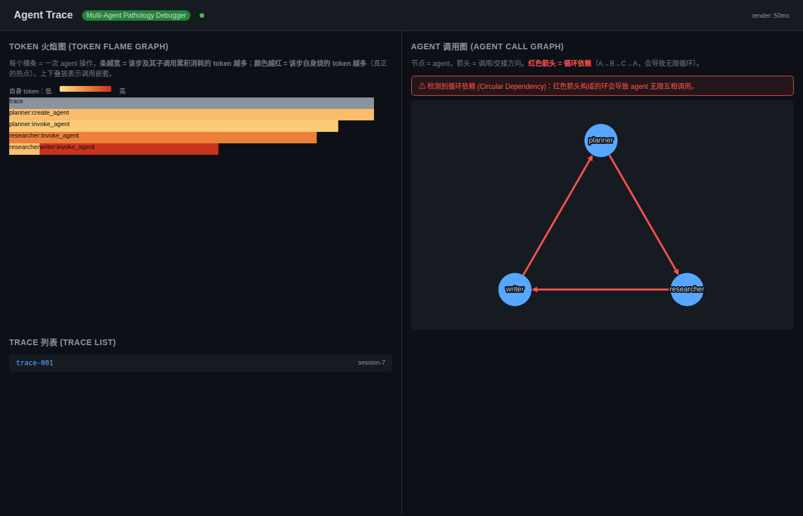
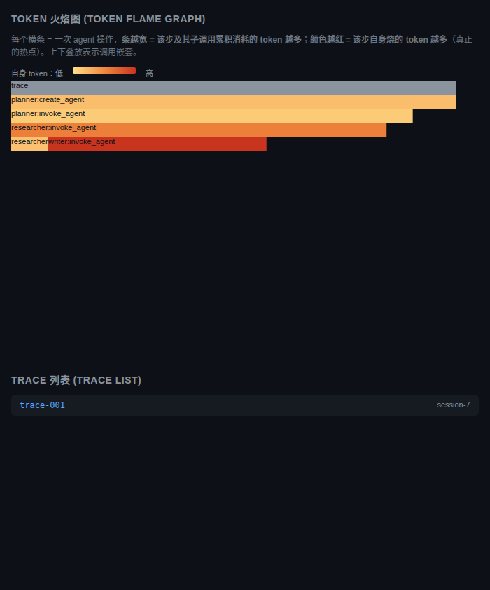
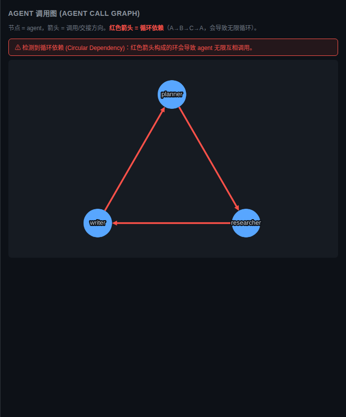

[English](README.md) | [中文](README_zh.md)

# Agent Trace

**Agent Trace** 是一个面向多智能体（Multi-Agent）系统做"病理诊断"的轻量级调试器。

当你用 LangGraph、CrewAI 或自研框架把多个 LLM Agent 串起来协作时，会遇到三类单 Agent 系统不会出现的疑难杂症：

- **死锁（Deadlock）**：Agent A 等待 B 释放资源，B 也在等 A，整个系统无声挂起，没有任何报错。
- **循环依赖（Circular Dependency）**：A 交给 B，B 交给 C，C 又交回 A，无限互相调用，烧光 token 却没有产出。
- **上下文膨胀（Context Bloat）**：对话越拖越长，token 累积超出模型窗口，上下文被截断，推理质量断崖式下降。

现有的可观测性工具（Langfuse、Phoenix、Helicone）回答的是"**发生了什么**"，它们展示调用链和指标。Agent Trace 回答的是"**哪里出了病**"，它用结构化算法（Tarjan SCC 检环、WFG 检死锁、EMA 预测膨胀）直接指出系统病灶，每个算法都经过 100% 准确率门控验证。

所有数据都存在本地 SQLite 文件里。不用装 Postgres、不用起 ClickHouse、也不用配 Docker，`pip install` 完直接用。自带 Web UI，火焰图看 token 去向，调用图看 Agent 拓扑和循环。

> **声明**：这是一个个人项目，开发和测试资源有限，功能与结论仅供参考，不构成生产级保证。欢迎提 Issue 和 PR。

[]()
[]()
[]()
[]()

---

## 为什么需要 Agent Trace？

多智能体系统会以一种单 Agent 系统不会发生的方式失败：

- **死锁**：Agent A 等待 Agent B 的资源，同时 B 在等 A 的资源，导致系统静默挂起。
- **循环依赖**：A 委托给 B，B 委托给 C，C 又委托回 A，产出无限循环。
- **上下文膨胀**：Token 累积超出模型窗口，上下文被截断，推理质量随之下降。

现有工具（Langfuse、Phoenix、Helicone）聚焦于**可观测性**：告诉你发生了什么。Agent Trace 聚焦于**病灶检测**：告诉你哪里出了错，使用结构化算法，结果可证明正确。

## 快速开始

```bash
pip install agent-trace[web]
```

```python
from agent_trace.detectors import CycleDetector, DeadlockDetector

# 检测 Agent 之间的循环依赖
cycle = CycleDetector()
cycle.add_handoff("planner", "researcher")
cycle.add_handoff("researcher", "writer")
cycle.add_handoff("writer", "planner")  # → CycleDetected!

# 检测资源死锁
deadlock = DeadlockDetector()
deadlock.acquire("agent_a", "resource_1")
deadlock.acquire("agent_b", "resource_2")
deadlock.request("agent_a", "resource_2")
deadlock.request("agent_b", "resource_1")  # → DeadlockDetected!
```

启动 Web UI：

```bash
agent-trace serve --db ./traces.db --port 7600
```

在浏览器中打开 `http://localhost:7600` 即可看到火焰图和调用图。

## 截图

### 总览



主面板列出最近的运行记录，包含 token 总量、告警数量，以及跳转到每次运行可视化视图的链接。

### Token 火焰图



火焰图是 token 归因的主视图。读图要点：

- **宽度** = 累计 token 消耗（本步骤加上所有嵌套子步骤）。宽条代表占用本次运行的大头。
- **颜色** = 本步骤**自身**的 token 消耗，使用暖色渐变：浅黄 → 橙 → 深红。颜色越红，代表这一步单独烧掉的 token 越多。
- **容器型步骤**（例如 `planner`）通常又宽又浅。它们负责委派，不做实际计算。
- **烧 token 的叶子步骤**（例如 `writer`）既宽又深红，那才是真正的热点。

点击任意一根条形可下钻到对应子树。

### Agent 调用图



调用图展示 Agent 之间的委派拓扑。读图要点：

- **布局** = 圆形布局，跨运行稳定（无抖动，无力导漂移）。
- **节点** = Agent。**边** = 委派关系（`A → B` 表示 A 委派给 B）。
- **红色箭头** = Tarjan SCC 算法检测到的循环依赖。
- **警告横幅** = 当图中存在一个或多个环路时，显示在页面顶部。

## 功能对比

| 功能 | Agent Trace | Langfuse | Phoenix | Helicone |
|---|---|---|---|---|
| 死锁检测 | ✅ WFG + DFS | ❌ | ❌ | ❌ |
| 循环依赖 | ✅ Tarjan SCC | ❌ | ❌ | ❌ |
| 上下文膨胀预测 | ✅ EMA + 4 级 | ❌ | ❌ | ❌ |
| 异常检测 | ✅ 5 特征 RF 风格 | 基础 | ❌ | ❌ |
| OTel GenAI 语义 | ✅ v1.41 | 部分 | 部分 | ❌ |
| 零基础设施 | ✅ SQLite 默认 | 需 Postgres | 需 ClickHouse | 需 Postgres |
| Web 可视化 | ✅ 火焰图 + 调用图 | ✅ | ✅ | ✅ |
| 准确率门控 | ✅ 每模块 100% | N/A | N/A | N/A |

## 算法与准确率

每个检测模块发布前都必须通过 **100% 准确率门控**（精确率 + 召回率）：

| 模块 | 算法 | 基准 | 结果 |
|---|---|---|---|
| 循环检测 | Tarjan SCC (O(V+E)) | 50 张图（25 含环 + 25 DAG） | F1 = 1.0000 |
| 死锁检测 | WFG + 增量 DFS | 20 个场景（10 死锁 + 10 安全） | P = R = 1.0 |
| 上下文膨胀 | tiktoken + 三层 EMA | 100 步实验 | MAE = 1.0%，告警 100% |
| 异常检测 | 5 特征加权投票 | 100 个场景（50 异常 + 50 正常） | F1 = 1.0000 |
| Web API | FastAPI + d3-flame-graph + cytoscape | 4 端点组合 | 24.9ms（< 500ms） |

## 架构

```
┌─────────────────────────────────────────────┐
│           Your Multi-Agent App              │
│   (LangGraph / CrewAI / custom OTel)        │
└──────────────────┬──────────────────────────┘
                   │ OTel GenAI spans
                   ▼
┌─────────────────────────────────────────────┐
│         AgentSpanEmitter (M1)               │
│   5 span types per OTel GenAI v1.41         │
└──────────────────┬──────────────────────────┘
                   │
         ┌─────────┴─────────┐
         ▼                   ▼
┌─────────────────┐  ┌───────────────────────┐
│  SQLiteBackend  │  │  Detectors (M3-M5,M7) │
│  (M2, WAL mode) │  │  Cycle / Deadlock /   │
│  traces         │  │  Bloat / Anomaly      │
│  observations   │  └───────────┬───────────┘
│  scores         │              │ alerts
└────────┬────────┘              ▼
         │              ┌───────────────────┐
         │              │  WebSocket stream │
         ▼              └─────────┬─────────┘
┌─────────────────────────────────┴───────────┐
│          Web UI (M6)                         │
│  d3-flame-graph (token tree)                │
│  cytoscape.js (agent call graph)            │
└─────────────────────────────────────────────┘
```

## 环境要求

- **Python**：3.10 或更高版本（在 3.12 上开发与测试）。包元数据 `pyproject.toml` 中声明 `requires-python = ">=3.10"`。
- **操作系统**：Linux、macOS 或 Windows。Linux 是主要的开发与 CI 目标平台；macOS 和 Windows 受支持但测试频率较低。
- **外部服务**：无需任何外部服务。SQLite 内置于 Python 标准库，存储后端开箱即用，无需安装或运行数据库服务。
- **浏览器**（用于 Web UI）：任意现代 evergreen 浏览器均可，Chrome、Firefox、Edge 都可以。UI 依赖 d3-flame-graph 和 cytoscape.js，两者都面向当前的 WebKit、Gecko 和 Blink 引擎。
- **网络**：Web UI 默认绑定 `localhost:7600`。Agent Trace 本身不发起任何出站请求。

## 安装

### 从 PyPI 安装（待发布）

```bash
pip install agent-trace[web]
```

### 从源码安装

```bash
# 1. 克隆仓库
git clone https://github.com/agent-trace/agent-trace.git
cd agent-trace

# 2. 创建并激活虚拟环境
python3 -m venv .venv
source .venv/bin/activate    # Linux/macOS
# .venv\Scripts\activate     # Windows

# 3. 安装全部 extras（dev + web）
pip install -e ".[dev,web]"

# 4. 验证安装
pytest tests/ -q              # 应显示 148 passed
agent-trace --help            # 应显示 CLI 帮助
```

### 仅 Web UI（轻量）

如果只需要可视化服务，不需要开发与测试工具：

```bash
pip install "agent-trace[web]"
agent-trace serve --db ./traces.db --port 7600
# 浏览器打开 http://localhost:7600
```

## 使用方法

### 循环检测

```python
from agent_trace.detectors import CycleDetector

detector = CycleDetector(on_cycle=lambda e: print(f"Cycle: {e.cycle}"))
detector.add_handoff("agent_a", "agent_b")
detector.add_handoff("agent_b", "agent_c")
detector.add_handoff("agent_c", "agent_a")
# → CycleDetected(cycle=('agent_a', 'agent_b', 'agent_c', 'agent_a'))
```

### 死锁检测

```python
from agent_trace.detectors import DeadlockDetector

detector = DeadlockDetector()
detector.acquire("agent_a", "db_connection")
detector.acquire("agent_b", "file_lock")
detector.request("agent_a", "file_lock")   # a 等待 b
detector.request("agent_b", "db_connection")  # b 等待 a → DeadlockDetected!
```

### 上下文膨胀预测

```python
from agent_trace.detectors import ContextBloatDetector, BloatLevel

detector = ContextBloatDetector(context_window=128000)
for step in agent_workflow:
    alert = detector.track("agent_1", step.output_text)
    if alert and alert.level == BloatLevel.CRITICAL:
        # 触发上下文压缩 / 摘要
        break

# 预测未来 token 用量
predicted = detector.predict("agent_1", steps_ahead=5)
```

### 异常检测

```python
from agent_trace.detectors import AnomalyDetector

detector = AnomalyDetector(context_window=128000)
result = detector.evaluate(
    agent_id="agent_1",
    token_history=[100, 200, 500, 1200],
    span_total=10,
    span_errors=3,
    handoff_depth=6,
    cycle_alerts=1,
    context_tokens=110000,
)
if result.is_anomaly:
    print(f"异常！Score={result.score:.2f}")
    print(f"触发特征：{result.triggered_features}")
```

### OTel 集成

```python
from agent_trace.otel import AgentSpanEmitter

emitter = AgentSpanEmitter(
    tracer=tracer,
    agent_name="my_agent",
    agent_id="agent_001",
    model="gpt-4o",
    provider="openai",
)

with emitter.create_agent_span(metadata={"tools": ["search", "calc"]}):
    with emitter.invoke_agent_client_span(
        target_agent_id="agent_002",
        input={"query": "hello"},
    ):
        result = call_agent_002()
```

### Web UI

```python
from agent_trace.web import create_app
from agent_trace.storage import SQLiteBackend

storage = SQLiteBackend("./traces.db")
app = create_app(storage=storage)

# 用 uvicorn 启动
import uvicorn
uvicorn.run(app, host="0.0.0.0", port=7600)
```

## 演示

```bash
python examples/demo_deadlock.py
```

该脚本运行一个 4 Agent 场景，会触发全部三类病灶：

1. **循环依赖**：3 个 Agent 形成委派环路。
2. **死锁**：2 个 Agent 各自获取资源后互相请求对方的资源。
3. **上下文膨胀**：Token 累积触发 WARNING → ERROR → CRITICAL。
4. **异常检测**：5 特征模型把该 Agent 标记为异常。

## 开发

```bash
# 运行全部测试（148 个测试，100% 准确率门控）
pytest tests/ -v

# 运行某个模块的门控
pytest tests/test_cycle_detector.py -v -s

# 运行 Web 延迟基准
pytest tests/test_web.py::TestRenderLatency -v -s
```

## 项目结构

```
agent-trace/
├── src/agent_trace/
│   ├── otel/              # M1：OTel GenAI v1.41 span emitter
│   ├── storage/           # M2：SQLite 后端 + 抽象接口
│   ├── detectors/         # M3-M5、M7：病灶检测器
│   │   ├── cycle_detector.py       # Tarjan SCC
│   │   ├── deadlock_detector.py    # WFG + 增量 DFS
│   │   ├── context_bloat.py        # tiktoken + 三层 EMA
│   │   └── anomaly_detector.py     # 5 特征加权投票
│   └── web/               # M6：FastAPI + d3-flame-graph + cytoscape
├── tests/                 # 148 个测试，100% 准确率门控
├── examples/              # 演示脚本
├── benchmarks/            # 准确率基准脚本
├── PLAN.md                # 执行计划（8 个模块，3 个 wave）
├── CONTRIBUTING.md
└── LICENSE                # Apache 2.0
```

## 路线图

- **v0.2**：PostgreSQL 后端（可插拔 StorageBackend）+ LangGraph 装饰器
- **v0.3**：OTLP HTTP receiver，接收远程 Agent 应用
- **v0.4**：语义循环检测（基于 LLM 的意图相似度）
- **v0.5**：EGTP（Enhanced Gradient-based Token Prediction）用于膨胀预测

## 许可证

Apache 2.0。详见 [LICENSE](LICENSE)。

## 贡献

参见 [CONTRIBUTING.md](CONTRIBUTING.md)。所有贡献必须通过 100% 准确率门控。

## Star 历史

如果 Agent Trace 帮你调试了多智能体系统，欢迎 ⭐ Star 本仓库。这能帮助更多人发现这个项目。
